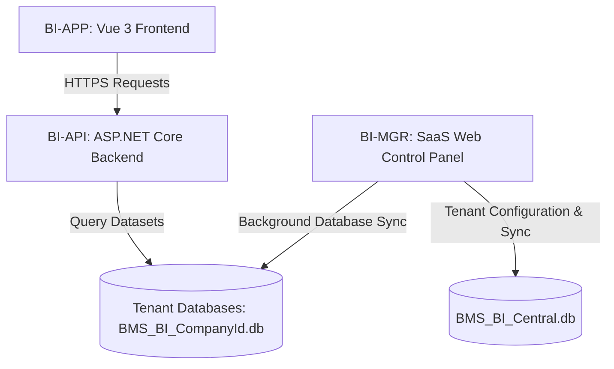

# Bimasakti Business Intelligence Service

Bimasakti Business Intelligence (BI) Service is an enterprise-grade, multi-tenant analytics and reporting platform designed for the Bimasakti ERP ecosystem. The system extracts, normalizes, and visualizes financial ledger accounts and operational metrics from client databases.

---

## System Architecture

The application is structured into three distinct layers under a unified solution:



1.  **[BI-APP](file:///d:/Projects/IDEs/BIMASAKTI%20BI%20Service/BI-APP)** (Frontend): A single-page application built on Vue 3, TypeScript, Tailwind CSS v4, Pinia, and Apache ECharts.
2.  **[BI-API](file:///d:/Projects/IDEs/BIMASAKTI%20BI%20Service/BI-API)** (Core API Service): An ASP.NET Core Web API delivering authenticated reporting endpoints and reporting query engines.
3.  **[BI-MGR](file:///d:/Projects/IDEs/BIMASAKTI%20BI%20Service/BI-MGR)** (SaaS Manager Service): A utility service running background synchronization jobs, managing tenant registrations, user permission profiles, and maintaining system audit logs.

---

## Core Features

*   **Security and Compliance:** Implements automated security headers, strict Content-Security-Policy (CSP), cookie/JWT access tokens with automatic renewal mechanisms, and built-in PII (Personally Identifiable Information) masking filters in logging channels.
*   **Dynamic Widget and Analytics Engine:** Supports dynamic chart dimensions, aggregate metrics, and sign-correction logic based on standard accounting conventions.
*   **Multi-Tenant Isolation:** Segregates databases by company identifier to guarantee data security and isolation.
*   **Interactive Documentation:** Integrates the Scalar API Reference engine, accessible at the `/docs` endpoint.
*   **Comprehensive Testing:** Supported by unit and integration tests (Xunit, Moq) for authentication, custom ledger rules, and database synchronization.

---

## Getting Started

### Prerequisites
*   .NET SDK 8.0 or newer
*   Node.js v20 or newer
*   npm

### Local Development Environment Setup

To run the application locally, use the developer CLI launcher:

1.  Open a terminal in the root directory.
2.  Run the launcher script:
    ```powershell
    .\manager.bat
    ```
3.  Select option **`3` (Check Dependencies)** to verify node packages and .NET runtimes.
4.  Select option **`1` (Launch Full Development Stack)** to start all services:
    *   **BI-API** Core will run on port `8001`
    *   **BI-APP** Frontend will run on port `8002`
    *   **BI-MGR** Management console will run on port `8003`

*Note: On initial startup, a cryptographically secure JWT secret and a temporary SuperAdmin password (printed to the console) will be automatically generated.*

---

## Developer Management Utilities

The root [manager.bat](file:///d:/Projects/IDEs/BIMASAKTI%20BI%20Service/manager.bat) utility script simplifies common operations:

*   **Launch Stack:** Starts backend, frontend, and control panels.
*   **Free Ports:** Terminates active processes bound to system ports (`8001` - `8003`).
*   **Clean Build Cache:** Removes all `bin/`, `obj/`, and `.vite` build assets.
*   **Compile Production Build:** Generates a framework-dependent production bundle inside `Publish/IIS/` and prepares baseline database synchronization configurations.

---

## Verification and Testing

To execute the test suite containing unit validations and database integration tests:

```bash
dotnet test BI-API/tests/BI-API.Tests.csproj
```
